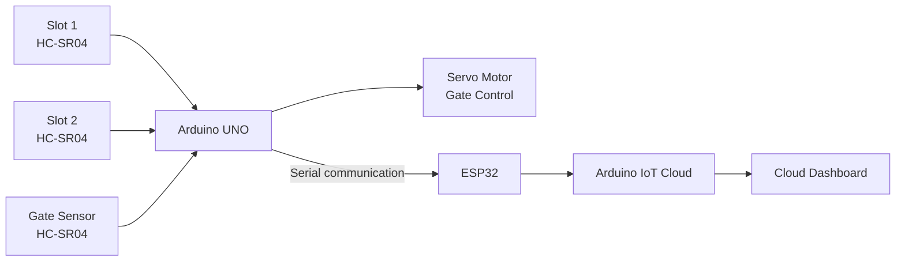

# Smart Car Parking System

An IoT-based smart parking prototype developed using **Arduino UNO, HC-SR04 ultrasonic sensors, a servo motor, and ESP32**.

## Overview

The system uses ultrasonic sensors to detect vehicle presence in parking spaces and at the entrance. Based on slot availability, the Arduino controls a servo-operated gate and sends parking status messages over serial communication.

The original project also included an **Arduino IoT Cloud** dashboard for displaying parking and gate status.

## System Architecture



## How It Works

1. Two ultrasonic sensors monitor the parking slots.
2. A third ultrasonic sensor detects a vehicle at the entrance.
3. The Arduino determines whether a parking slot is available.
4. If a vehicle is detected and a slot is available, the servo opens the gate.
5. The Arduino sends slot and vehicle-status messages over serial communication.
6. The ESP32 receives the Arduino data and updates the corresponding Arduino IoT Cloud variables.

## Hardware

- Arduino UNO
- HC-SR04 ultrasonic sensors
- Servo motor
- ESP32
- Breadboard
- Connecting wires
- Power supply

## Software

- Arduino IDE
- Arduino IoT Cloud
- Tinkercad

## Repository Structure

```text
smart-car-parking-system/
├── README.md
├── .gitignore
├── docs/
│   └── pin-connections.md
└── src/
    ├── arduino/
    │   └── parking.ino
    └── esp32/
        └── esp.ino
```

## Source Code

### Arduino — `parking.ino`

The Arduino sketch contains the main parking and gate-control logic:

- Reads two parking-slot ultrasonic sensors.
- Reads the entrance/gate ultrasonic sensor.
- Determines the number of available slots.
- Identifies an available parking slot.
- Opens and closes the gate using the servo motor.
- Sends parking and vehicle-status messages to the ESP32 over Serial.

The current implementation actively checks **two parking slots**. The source contains commented-out code for a possible third slot, but it is not active.

### ESP32 — `esp.ino`

The ESP32 sketch handles communication between the Arduino and the Arduino IoT Cloud.

It:

- Receives data from the Arduino through `Serial2`.
- Processes `message`, `message2`, and `slots` messages.
- Updates the Cloud variables `status`, `car_stat`, `gate_1`, and `gate_2`.
- Connects to Arduino IoT Cloud using the generated `thingProperties.h` configuration.

The required `thingProperties.h` file is **not included** because it is generated by Arduino IoT Cloud and contains account-specific configuration.

To use the ESP32 Cloud sketch, create/configure your own Arduino IoT Cloud Thing and add your generated `thingProperties.h` file.

> **Note:** Do not commit Wi-Fi credentials, API keys, passwords, or other account-specific secrets to GitHub.

## Pin Connections

See [docs/pin-connections.md](docs/pin-connections.md).

### Arduino UNO

| Component | Pin |
|---|---:|
| Slot 1 ultrasonic TRIG | 6 |
| Slot 1 ultrasonic ECHO | 7 |
| Slot 2 ultrasonic TRIG | 4 |
| Slot 2 ultrasonic ECHO | 5 |
| Gate ultrasonic TRIG | 10 |
| Gate ultrasonic ECHO | 11 |
| Servo signal | 9 |

### ESP32

| Signal | GPIO |
|---|---:|
| RX2 | 16 |
| TX2 | 17 |

## Arduino Dependencies

The Arduino parking sketch uses:

- **NewPing**
- **Servo**

Install the required libraries through the Arduino IDE before compiling.

The ESP32 sketch additionally requires the Arduino IoT Cloud libraries and your generated `thingProperties.h` configuration.

## Prototype

The original project included a physical prototype demonstrating three parking scenarios:

1. Both slots empty and a car at the gate.
2. One slot occupied and a car at the gate.
3. Both slots occupied and a car at the gate.

The Cloud dashboard displayed the corresponding slot/gate states and messages for these scenarios.

## Arduino IoT Cloud

The original project used Arduino IoT Cloud variables including:

- `status`
- `car_stat`
- `gate_1`
- `gate_2`

The dashboard UI and Cloud configuration were part of the original project. This repository contains the available ESP32 sketch, but not the generated `thingProperties.h` file or the original Cloud account configuration.

## Project Status

This repository contains the source code currently available from the original academic project and is maintained as a portfolio/interview reference.
