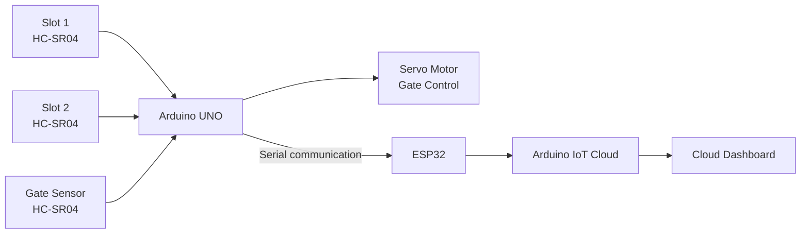

# Smart Car Parking System

An IoT-based smart parking prototype developed using **Arduino UNO, HC-SR04 ultrasonic sensors, a servo motor, and ESP32**.

## Overview

The system uses ultrasonic sensors to detect vehicle presence in parking spaces and at the entrance. Based on slot availability, the Arduino controls a servo-operated gate and sends parking status messages over serial communication.

The original academic project also included an **Arduino IoT Cloud** component for displaying parking and gate status.

## System Architecture



## How It Works

1. Two ultrasonic sensors monitor the parking slots.
2. A third ultrasonic sensor detects a vehicle at the entrance.
3. The Arduino determines whether a parking slot is available.
4. If a vehicle is detected and a slot is available, the servo opens the gate.
5. The Arduino sends slot and gate messages over serial communication.
6. The ESP32 side handles the serial/cloud portion of the original project.

## Hardware

- Arduino UNO
- HC-SR04 ultrasonic sensors
- Servo motor
- ESP32
- Breadboard
- Connecting wires
- Power supply

## Software

- Arduino IDE
- Arduino IoT Cloud
- Tinkercad

## Repository Structure

```text
smart-car-parking-system/
├── README.md
├── .gitignore
├── docs/
│   └── pin-connections.md
└── src/
    ├── arduino/
    │   └── parking.ino
    └── esp32/
        └── esp.ino
```

## Source Code

### Arduino

`src/arduino/parking.ino` contains the main parking logic:

- Reads the two active parking-slot ultrasonic sensors.
- Reads the entrance/gate ultrasonic sensor.
- Determines available slots.
- Opens/closes the gate using the servo.
- Sends slot and vehicle-status messages through Serial.

The available implementation actively checks **two parking slots**. A third-slot implementation remains commented out in the source.

### ESP32

`src/esp32/esp.ino` is the available ESP32-side sketch. It defines GPIO 16 and 17 for the intended serial interface, while the `Serial2` initialization is currently commented out in the available file.

The original Cloud-connected implementation used an Arduino IoT Cloud-generated `thingProperties.h` file, which is not available in this repository.

## Pin Connections

See [docs/pin-connections.md](docs/pin-connections.md).

## Arduino Dependencies

The Arduino parking sketch uses:

- **NewPing**
- **Servo**

Install the required libraries through the Arduino IDE before compiling.

## Prototype

The original project included a physical prototype demonstrating:

- Both parking slots empty
- One parking slot occupied
- Both parking slots occupied
- Vehicle detection at the gate
- Slot assignment/status displayed through the Cloud dashboard

Prototype and dashboard screenshots can be added to `docs/images/` when needed.

## Arduino IoT Cloud

The original project included an Arduino IoT Cloud dashboard with status indicators for the parking slots and vehicle/gate state.

The Cloud-generated `thingProperties.h` configuration and account-specific settings are **not included** because the original Cloud project is no longer accessible.

**No credentials, API keys, passwords, or account configuration should be committed to this repository.**

## Project Status

This repository preserves the source code currently available from the original academic project and is maintained as a portfolio/interview reference.

